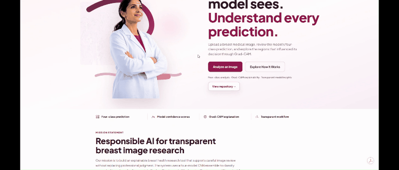
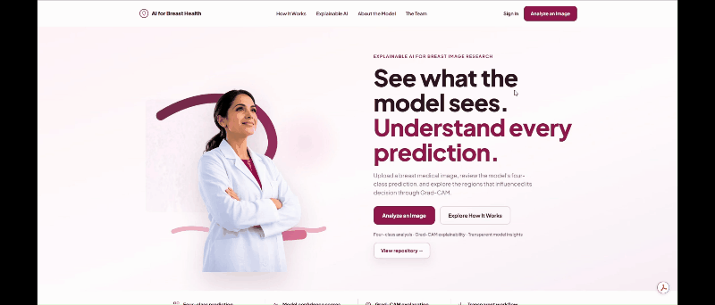
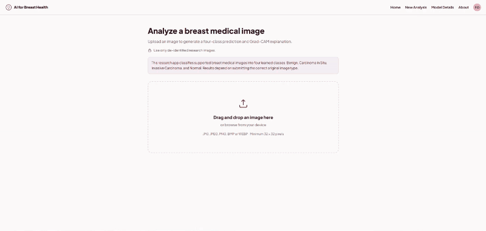

<div align="center">


# Breast Cancer Detection

**See what the model sees. Understand every prediction.. Upload a breast medical image, review the model's four-class prediction, and explore the regions that influenced its decision through Grad-CAM. This is an academic explainable-AI prototype for breast image analysis, with a FastAPI backend and React research interface.**

</div>

---

## Mission Statement

Our mission is to build an explainable breast health research tool that supports careful image review without replacing professional judgment. The system uses a four-model CNN ensemble to classify supported breast medical images into Benign, Carcinoma In Situ, Invasive Carcinoma, and Normal, while keeping uncertainty, limitations, and visual evidence visible to the user.


This ML project was built as the final team project for **AI4ALL Ignite Summer Program**.

> **Project status:** The course project has been completed, submitted, and demonstrated. Ongoing work focuses on post-course documentation, maintenance, and portfolio polish while preserving the functionality of the submitted application.

---

## Preview

### Project Application

Explore our landing page and our mission along with model and team information.



### Login or create an account

Login or create an account to access our Model Detection!.



### Our Breast Cancer Detection Model

Once authorized, you may apply the supported histology images into our 4-models-esembler system.



---

## Features

Users can create an account then login later to access our model to have the model give an unofficial diognosis based on histology image's features.

The follow models:

- DenseNet121
- VGG16
- EfficientNet
- ResNet50


The project dashboard results reveals second-opinion classification of what may be in the image and follows ethical AI guidelines for user's safety.

---


## Prerequisites

- [Python](https://www.python.org/downloads/) 3.11+
- [Node.js](https://nodejs.org/) 18+ (20 recommended)
- npm (comes with Node.js)

## First-Time Backend Setup

Run this once after cloning the repo:

```powershell
cd server
python -m venv .venv
.\.venv\Scripts\python.exe -m pip install -r requirements.txt
cd ..
```

This creates a local backend virtual environment at `server/.venv`. Do not reinstall dependencies every time.

## Start The Backend

From the repo root:

```powershell
.\server\start-backend.ps1
```

The API runs at:

```text
http://127.0.0.1:8000
```

## Start The Frontend

From the repo root:

```powershell
cd frontend
npm install
npm run dev
```

Then open the URL Vite prints, usually:

```text
http://localhost:5173
```

## Daily Development

Use two terminals:

```powershell
.\server\start-backend.ps1
```

```powershell
cd frontend
npm run dev
```

## Useful Frontend Commands

Run these from `frontend/`:

| Command | What it does |
|---------|--------------|
| `npm run dev` | Start local development server |
| `npm run build` | Create production build in `frontend/dist` |
| `npm run preview` | Preview the production build locally |

## Project Layout

```text
frontend/   React UI (Vite + TypeScript)
server/     FastAPI backend and model inference code
```

More frontend detail: [frontend/README.md](frontend/README.md)
